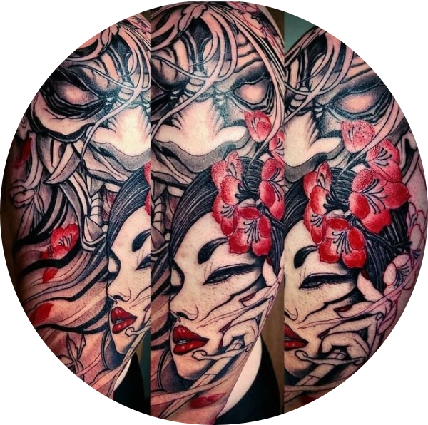

### Hi, my name is Chung 👋

</ul>

 

<h4>Languages</h4>

<h4>Frameworks</h4>

  
<h4>Other</h4>

<h4>Learning</h4>

<!--
**ChungGold/ChungGold** is a ✨ _special_ ✨ repository because its `README.md` (this file) appears on your GitHub profile.

Here are some ideas to get you started:

- 🔭 I’m currently working on ...
- 🌱 I’m currently learning ...
- 👯 I’m looking to collaborate on ...
- 🤔 I’m looking for help with ...
- 💬 Ask me about ...
- 📫 How to reach me: ...
- 😄 Pronouns: ...
- ⚡ Fun fact: ...
-->
